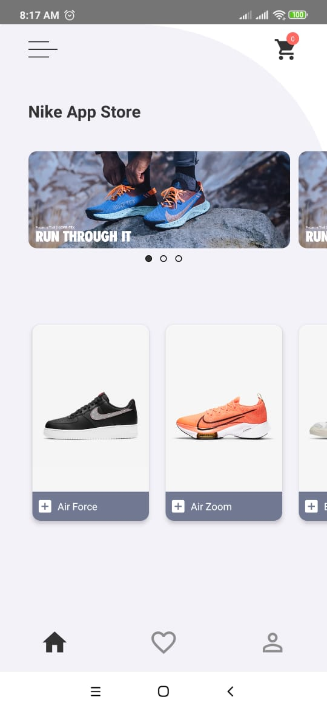
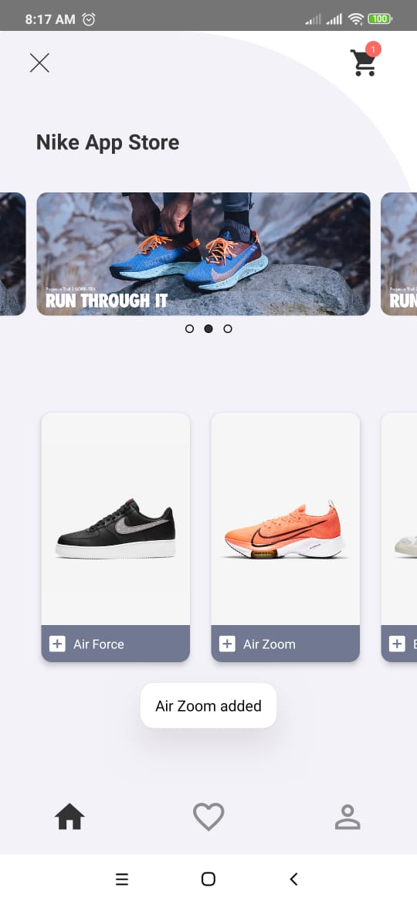
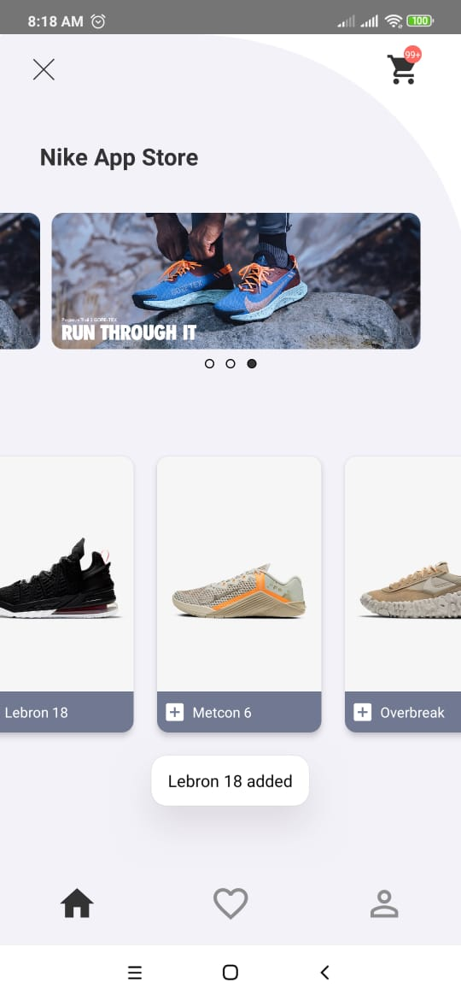
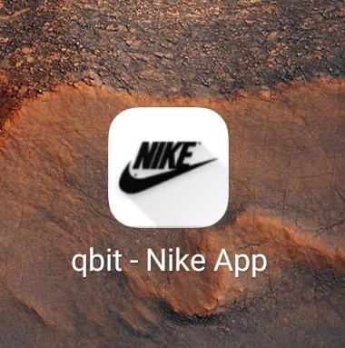

# qbit React Native Nike App

At [qbit](https://www.qbit.co.id), i try to create a react native application based on mockup. This is just an example of a react native application.

The app itself is more like simple shopping app. There are many features including snap carousel, product slider, cart, and hamburger menu. It's important to note that this application only developed to be run on android. iOS? Soon i think XD

### Android

* You might need to do this to run it in Android Studio or on real device: `adb reverse tcp:8081 tcp:8081`
* And for the sample server: `adb reverse tcp:3000 tcp:3000`
* To run from command line try: `react-native run-android`

### iOS

We'll get there, but we're still working on the Android version.

# Current Concepts

### Navigation

Navigation using [react-navigation](https://reactnavigation.org/) to create a stable routing experience.

### Other things

Other things you can explore it by yourself

## License

[GNU Public License](https://www.gnu.org/licenses/gpl-3.0.en.html)